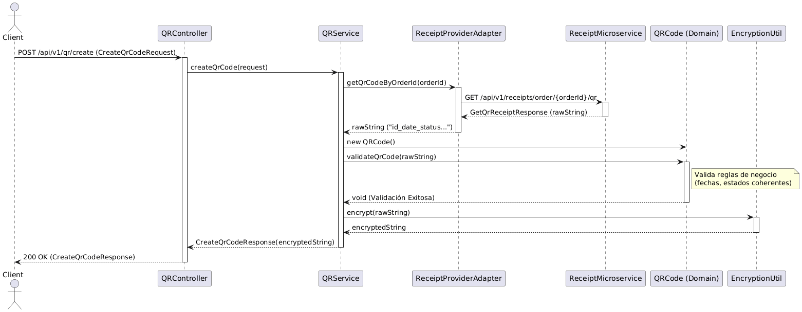
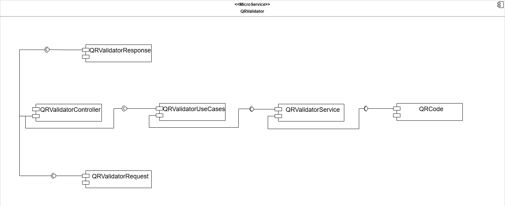
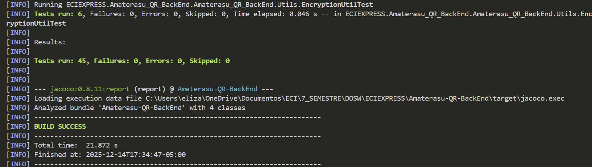
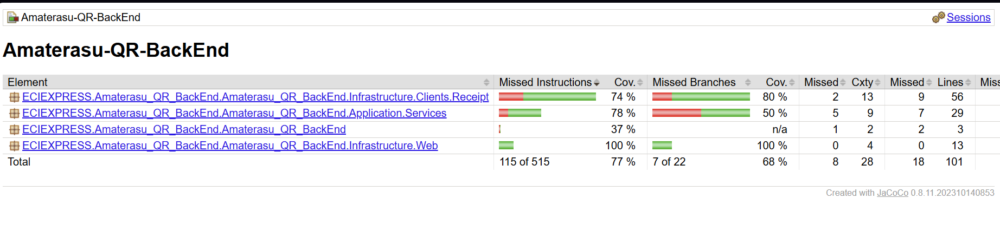
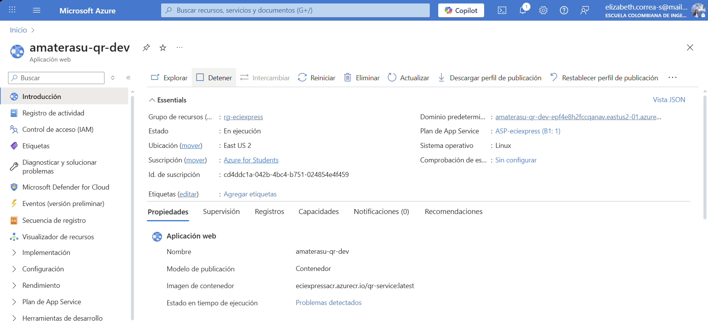
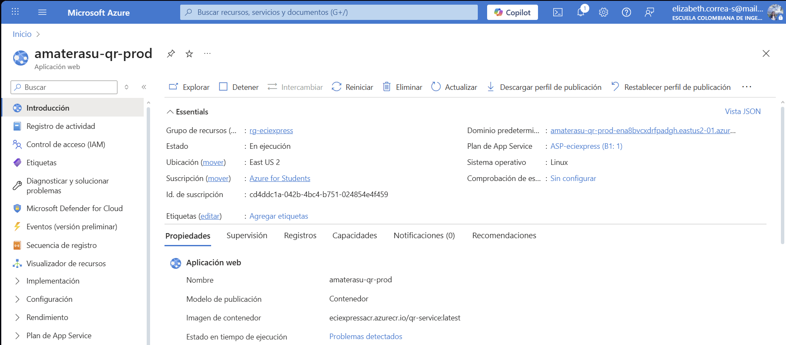

<div align="center">

# 📚 ECIEXPRESS — Microservicio de Validación QR

### *"Sin filas, sin estrés, ECIEXPRESS"*

---

### 🛠️ Stack Tecnológico


### ☁️ Infraestructura & Calidad


### 🏗️ Arquitectura


</div>

---

## 📑 Tabla de Contenidos

1. [👤 Integrantes](#1--integrantes)
2. [🎯 Objetivo del Microservicio](#2--objetivo-del-microservicio)
3. [⚡ Funcionalidades Principales](#3--funcionalidades-principales)
4. [📋 Estrategia de Versionamiento y Branches](#4--manejo-de-estrategia-de-versionamiento-y-branches)
   - [4.1 Convenciones para crear ramas](#41-convenciones-para-crear-ramas)
   - [4.2 Convenciones para crear commits](#42-convenciones-para-crear-commits)
5. [⚙️ Tecnologías Utilizadas](#5--tecnologias-utilizadas)
6. [🧩 Funcionalidad](#6--funcionalidad)
7. [📊 Diagramas](#7--diagramas)
8. [⚠️ Manejo de Errores](#8--manejo-de-errores)
9. [🧪 Evidencia de Pruebas y Ejecución](#9--evidencia-de-las-pruebas-y-como-ejecutarlas)
10. [🗂️ Organización del Código](#10--codigo-de-la-implementacion-organizado-en-las-respectivas-carpetas)
11. [🚀 Ejecución del Proyecto](#11--ejecucion-del-proyecto)
12. [☁️ CI/CD y Despliegue en Azure](#12--evidencia-de-cicd-y-despliegue-en-azure)
13. [🤝 Contribuciones](#13--contribuciones)

---

## 1. 👤 Integrantes:

- Elizabeth Correa
- Daniel Palacios
- David Salamanca
- Tomas Ramirez
- Carolina Cepeda

## 2. 🎯 Objetivo del microservicio

El microservicio de Validación QR tiene como objetivo garantizar un proceso de entrega de pedidos ágil, seguro y trazable dentro de la plataforma ECIExpress, mediante la generación y validación de códigos QR únicos asociados a cada pedido confirmado y pagado. Este servicio permite verificar la autenticidad del pedido en el punto de entrega, evitando entregas duplicadas, errores operativos o fraudes, y asegurando que solo los pedidos válidos puedan ser reclamados. Además, coordina la actualización del estado del pedido y del recibo tras una validación exitosa, integrándose con los microservicios de Recibos, Pagos y Pedidos para mantener la consistencia del flujo de compra y entrega dentro del campus. 

---

## 3. ⚡ Funcionalidades principales

<div align="center">

<table>
  <thead>
    <tr>
      <th>💡 Funcionalidad</th>
      <th>Descripción</th>
    </tr>
  </thead>
  <tbody>
    <tr>
      <td><strong>Generación de Código QR</strong></td>
      <td>Genera un código QR único asociado a un pedido confirmado y pagado, garantizando su unicidad y trazabilidad.</td>
    </tr>
    <tr>
      <td><strong>Validación de Código QR</strong></td>
      <td>Permite al vendedor validar el código QR al momento de la entrega para confirmar la autenticidad del pedido.</td>
    </tr>
    <tr>
      <td><strong>Control de Uso del QR</strong></td>
      <td>Bloquea códigos QR que ya hayan sido utilizados, evitando entregas duplicadas o fraudes.</td>
    </tr>
    <tr>
      <td><strong>Gestión de Expiración</strong></td>
      <td>Verifica que el código QR no se encuentre vencido antes de autorizar la entrega del pedido.</td>
    </tr>
    <tr>
      <td><strong>Confirmación de Entrega</strong></td>
      <td>Registra la entrega exitosa del pedido y la hora exacta de retiro del producto.</td>
    </tr>
    <tr>
      <td><strong>Registro de Entregas</strong></td>
      <td>Guarda el historial de validaciones realizadas, asociando pedido, vendedor y timestamp.</td>
    </tr>
    <tr>
      <td><strong>Validación Manual</strong></td>
      <td>Permite registrar la entrega de forma manual en caso de fallos técnicos con la lectura del QR.</td>
    </tr>
    <tr>
      <td><strong>Integración con otros Microservicios</strong></td>
      <td>Se comunica con los microservicios de Pedidos, Pagos y Recibos para actualizar el estado del pedido.</td>
    </tr>
    <tr>
      <td><strong>Manejo de Errores</strong></td>
      <td>Retorna respuestas claras ante códigos inválidos, vencidos o ya utilizados.</td>
    </tr>
  </tbody>
</table>

</div>
---

## 4. 📋 Manejo de Estrategia de versionamiento y branches

### Estrategia de Ramas (Git Flow)

### Ramas y propósito
- Manejaremos GitFlow, el modelo de ramificación para el control de versiones de Git

#### `main`
- **Propósito:** rama **estable** con la versión final (lista para demo/producción).
- **Reglas:**
    - Solo recibe merges desde `release/*` y `hotfix/*`.
    - Cada merge a `main` debe crear un **tag** SemVer (`vX.Y.Z`).
    - Rama **protegida**: PR obligatorio, 1–2 aprobaciones, checks de CI en verde.

#### `develop`
- **Propósito:** integración continua de trabajo; base de nuevas funcionalidades.
- **Reglas:**
    - Recibe merges desde `feature/*` y también desde `release/*` al finalizar un release.
    - Rama **protegida** similar a `main`.

#### `feature/*`
- **Propósito:** desarrollo de una funcionalidad, refactor o spike.
- **Base:** `develop`.
- **Cierre:** se fusiona a `develop` mediante **PR**


#### `release/*`
- **Propósito:** congelar cambios para estabilizar pruebas, textos y versiones previas al deploy.
- **Base:** `develop`.
- **Cierre:** merge a `main` (crear **tag** `vX.Y.Z`) **y** merge de vuelta a `develop`.
- **Ejemplo de nombre:**  
  `release/1.3.0`

#### `hotfix/*`
- **Propósito:** corregir un bug **crítico** detectado en `main`.
- **Base:** `main`.
- **Cierre:** merge a `main` (crear **tag** de **PATCH**) **y** merge a `develop` para mantener paridad.
- **Ejemplos de nombre:**  
  `hotfix/fix-blank-screen`, `hotfix/css-broken-header`


---

### 4.1 Convenciones para **crear ramas**

#### `feature/*`
**Formato:**
```
feature/[nombre-funcionalidad]-ECIExpress_[codigo-jira]
```

**Ejemplos:**
- `feature/readme_ECIExpress-34`

**Reglas de nomenclatura:**
- Usar **kebab-case** (palabras separadas por guiones)
- Máximo 50 caracteres en total
- Descripción clara y específica de la funcionalidad
- Código de Jira obligatorio para trazabilidad

#### `release/*`
**Formato:**
```
release/[version]
```
**Ejemplo:** `release/1.3.0`

#### `hotfix/*`
**Formato:**
```
hotfix/[descripcion-breve-del-fix]
```
**Ejemplos:**
- `hotfix/corregir-pantalla-blanca`
- `hotfix/arreglar-header-responsive`

---

### 4.2 Convenciones para **crear commits**

#### **Formato:**
```
[codigo-jira] [tipo]: [descripción específica de la acción]
```

#### **Tipos de commit:**
- `feat`: Nueva funcionalidad
- `fix`: Corrección de errores
- `docs`: Cambios en documentación

## 5. ⚙️ Tecnologías Utilizadas


| **Tecnología / Herramienta** | **Uso principal en el proyecto** |
|------------------------------|----------------------------------|
| **Java OpenJDK** | Lenguaje de programación base de los microservicios backend, orientado a objetos y multiplataforma. |
| **Spring Boot** | Framework principal para construir microservicios independientes, exponiendo APIs REST y gestionando configuración e inyección de dependencias. |
| **Spring Web** | Exposición de endpoints REST en cada microservicio (controladores HTTP) dentro de la arquitectura hexagonal. |
| **Spring Security** | Configuración de autenticación y autorización mediante roles, asegurando el acceso a los endpoints de los microservicios. |
| **Spring Data MongoDB** | Integración de cada microservicio con su base de datos NoSQL en MongoDB usando el patrón Repository y puertos/adaptadores. |
| **MongoDB Atlas** | Base de datos NoSQL en la nube, con colecciones independientes por dominio (pagos, billetera, recibos, promociones, usuarios, etc.). |
| **Apache Maven** | Gestión de dependencias, empaquetado de cada microservicio y automatización de builds en los pipelines CI/CD. |
| **Lombok** | Reducción de código repetitivo en los microservicios con anotaciones como `@Getter`, `@Setter`, `@Builder` y `@AllArgsConstructor`. |
| **JUnit 5** | Framework de pruebas unitarias para validar la lógica de dominio y casos de uso en cada microservicio. |
| **Mockito** | Simulación de dependencias (puertos, repositorios, clientes externos) en pruebas unitarias sin acceder a infraestructura real. |
| **JaCoCo** | Generación de reportes de cobertura de código de los microservicios para evaluar la efectividad de las pruebas. |
| **SonarQube** | Análisis estático del código y control de calidad, identificando vulnerabilidades, code smells y problemas de mantenibilidad. |
| **Swagger (OpenAPI 3)** | Generación automática de documentación y prueba interactiva de los endpoints REST de cada microservicio. |
| **Postman** | Entorno de pruebas de la API para validar manualmente las peticiones y respuestas JSON de los distintos microservicios (`POST`, `GET`, `PATCH`, `DELETE`). |
| **Docker** | Contenerización de cada microservicio para garantizar despliegues aislados y consistentes entre entornos. |
| **Azure App Service** | Entorno de ejecución en la nube donde se despliegan los contenedores Docker de los microservicios. |
| **Azure Container Registry (ACR)** | Almacenamiento y versionado de las imágenes Docker generadas en los pipelines de CI/CD. |
| **GitHub Actions** | Pipelines de integración y despliegue continuo (CI/CD) para compilar, probar, analizar y desplegar cada microservicio. |
| **AWS API Gateway** | Punto de entrada único al backend que enruta las solicitudes del cliente al microservicio correspondiente (Pagos, Wallet, Recibos, QR, etc.). |
| **AWS Lambda (Node.js)** | Funciones ligeras que actúan como lógica intermedia cuando se requiere preprocesar o adaptar solicitudes antes de enviarlas a los microservicios. |
| **SSL / HTTPS** | Cifrado de la comunicación entre cliente, API Gateway y microservicios para garantizar la seguridad de la información. |


> 🧠 **Stack tecnológico seleccionado** para asegurar **escalabilidad**, **modularidad**, **seguridad**, **trazabilidad** y **mantenibilidad**, aplicando buenas prácticas de ingeniería de software.

## 6. 🧩 Funcionalidades

---

### 🔑 Funcionalidades principales

### 1️⃣ Crear Código QR

Genera un código QR único asociado a un pedido confirmado y pagado, garantizando su unicidad y trazabilidad.

**Endpoint principal:**  
`POST /api/v1/qr/create`

---

### 📦 Estructura de la Solicitud (Request)

<div align="center">

| 🏷️ Campo    | 🗃️ Tipo | ⚠️ Restricciones                        | 📝 Descripción                                              |
|--------------|---------|:---------------------------------------:|-------------------------------------------------------------|
| orderId      | String  | Obligatorio, @NotBlank                  | Identificador único de la orden para la cual se generará el código QR. |

</div>

---

### 📦 Estructura de la Respuesta (Response)

<div align="center">

| 🔢 Código HTTP | 📝 Descripción |
|:---:|---|
|  | **Solicitud exitosa.** Retorna la cadena encriptada del QR. |

</div>

**Cuerpo de la respuesta:**
- `encodedQRCode` (String): Cadena de texto encriptada (AES) que representa la información del recibo, lista para ser renderizada como imagen QR.

---

### ✅ Happy Path (Ejemplo de Uso Exitoso)

1. El cliente envía un `orderId` válido.
2. El sistema valida el formato del ID.
3. Se consulta el servicio de Recibos para obtener los datos de la orden.
4. Se valida la coherencia de los datos (fechas, estado).
5. Se encripta la información y se genera el código QR.
6. Se retorna `200 OK` con el `encodedQRCode`.


**Request (Solicitud):**
```json
POST /api/v1/qr/create
{
  "orderId": "ORDER_12345"
}
```

**Response (Respuesta):**
```json
{
  "encodedQRCode": "U2FsdGVkX1+..."
}
```


---

### 🖼️ Diagrama de Secuencia

  


<details>
<summary><strong>🟢 Explicación del Flujo</strong></summary>

1. El proceso inicia cuando el cliente envía una solicitud POST al endpoint `/api/v1/qr/create` conteniendo el identificador de la orden (`orderId`).
2. El `QRController` recibe la petición, valida el cuerpo del mensaje mediante anotaciones (`@Valid`) y delega la lógica al `QRService`.
3. El servicio actúa como orquestador e invoca al puerto `ReceiptProvider` para obtener la cadena de datos cruda asociada a la orden desde el microservicio de Recibos.
4. Una vez obtenida la cadena, se instancia la entidad `QRCode` y se ejecuta `validateQrCode()` para asegurar la coherencia de los datos con las reglas de negocio.
5. Si la validación es exitosa, se utiliza `EncryptionUtil` para cifrar la cadena usando el algoritmo AES.
6. Finalmente, se retorna un `CreateQrCodeResponse` con el resultado cifrado y un estado HTTP 200 OK.

</details>
---

### 📊 Tipos de errores manejados

<div align="center">

| 🔢 **Código HTTP** | ⚠️ **Escenario** | 💬 **Mensaje de Error** |
|:------------------:|:----------------|:------------------------|
|  | orderId es nulo o vacío | `"orderId is required"` |
|  | Error al obtener datos de Recibos | `"Error creating QR code: Failed to get QR code for order..."` |
|  | Violación de reglas de negocio | `"Error creating QR code: Receipt can't be delivered in creation"` |
|  | Fallo en encriptación | `"Error creating QR code: Encryption failed"` |

</div>

---

### 2️⃣ Validar Código QR


**Endpoint principal:**  
`POST /api/v1/qr/validate`

---

### 📦 Estructura de la Solicitud (Request)

<div align="center">

| 🏷️ Campo    | 🗃️ Tipo | ⚠️ Restricciones                        | 📝 Descripción                                              |
|--------------|---------|:---------------------------------------:|-------------------------------------------------------------|
| encodedQrCode | String | Obligatorio, @NotBlank                  | La cadena encriptada obtenida al escanear el código QR físico o digital. |

</div>

---

### 📦 Estructura de la Respuesta (Response)

<div align="center">

| 🔢 Código HTTP | 📝 Descripción |
|:---:|---|
|  | **Validación exitosa.** No retorna cuerpo de respuesta. |

</div>

---

### ✅ Happy Path (Ejemplo de Uso Exitoso)

1. El cliente envía el `encodedQrCode`.
2. El sistema desencripta la cadena.
3. Se validan las reglas de negocio (fechas, estados).
4. Se actualiza el estado del recibo a "Pagado" y "Entregado".
5. Se retorna `200 OK`.


**Request (Solicitud):**
```json
POST /api/v1/qr/validate
{
  "encodedQrCode": "U2FsdGVkX1+..."
}
```


---

### 🖼️ Diagrama de Secuencia

  


<details>
<summary><strong>🟢 Explicación del Flujo</strong></summary>

1. El cliente envía una solicitud POST al endpoint `/api/v1/qr/validate` con la cadena encriptada escaneada (`encodedQrCode`).
2. El `QRController` recibe el DTO `ValidateQRRequest` y transfiere la ejecución al `QRService`.
3. El servicio utiliza `EncryptionUtil` para desencriptar la cadena recibida. Si falla, el proceso se detiene.
4. Con la cadena en texto plano, se instancia la entidad `QRCode` y se invoca su método `validateQrCode()`.
5. Este método descompone la cadena en sus 6 partes y aplica validaciones estrictas (número de partes, fechas, lógica temporal y estados).
6. Si la validación es exitosa, el servicio actualiza el estado en el sistema externo mediante `ReceiptProvider`:
   - Marca la orden como "Pagada" (`updateToPayed`).
   - Marca la orden como "Entregada" (`updateToDelivered`).
7. Al finalizar exitosamente, el servicio retorna `true` y el controlador responde con un código HTTP `200 OK`.

</details>


---

### 📊 Tipos de errores manejados

<div align="center">

| 🔢 **Código HTTP** | ⚠️ **Escenario** | 💬 **Mensaje de Error** |
|:------------------:|:----------------|:------------------------|
|  | encodedQrCode es nulo o vacío | `"encodedQrCode is required"` |
|  | Validación lógica falsa | (Sin cuerpo) |
|  | Fallo en desencriptación | `"Error validating QR code: Decryption failed"` |
|  | Violación de reglas de negocio | `"Error validating QR code: Payment processed at can't be after receipt generated date"` |
|  | Error de comunicación | `"Error validating QR code: Failed to update receipt to payed..."` |

</div>


---


## 7. 📊 Diagramas

Esta sección muestra los diagramas clave del microservicio de QR, ilustrando su arquitectura, componentes principales y despliegue.

---

### 🏗️ Diagrama de Componentes — Vista General
<div align="center">

</div>


---

### 🔍 Diagrama de Componentes — Vista Específica

<div align="center">

</div>

**Arquitectura Hexagonal:**  
El microservicio QRValidator gestiona la generación segura, encriptación y validación de códigos QR para garantizar la trazabilidad y seguridad en la entrega de pedidos dentro del ecosistema ECIEXPRESS.

**Flujo principal:**

- **QRController**
  - Expone endpoints REST para la creación y validación de códigos.
  - Recibe los datos a través de DTOs de entrada (`QRValidatorRequest` / `CreateQrCodeRequest`).
  - Delega la ejecución al puerto `QRValidatorUseCases`, implementado por `QRService`.

**Lógica de Negocio (Dominio):**

- **QRService**
  - Actúa como el núcleo orquestador del microservicio.
  - Asegura la integridad de la información mediante mecanismos de encriptación (AES).
  - Coordina la lógica de negocio utilizando la entidad de dominio `QRCode`.

- **QRCode (Entidad)**
  - Encapsula reglas de validación críticas.
  - Verifica la coherencia temporal entre la fecha de generación del recibo y el procesamiento del pago.
  - Valida las transiciones de estado (ej. impedir entrega si no ha sido pagado).

**Integración y Adaptadores:**

- **Integración:**
  - Este microservicio no persiste datos propios, sino que colabora con el microservicio de **Receipt**.
  - A través del puerto `ReceiptProvider` (implementado por `ReceiptProviderAdapter`), obtiene la cadena de datos original asociada a una orden.
  - Tras validación exitosa, invoca al servicio de recibos para actualizar el estado de la orden a `Payed` o `Delivered`.

### 🔌 Servicios Externos Integrados

El microservicio se integra con otros sistemas mediante REST/HTTP a través del API Gateway.

<div align="center">

| 🌍 **Microservicio** | ⚙️ **Operación** | 📋 **Propósito** |
|:---------------|:----------------|:-----------------------|
| **Receipt** | Obtener Datos / Actualizar Estado | Proveer la cadena de información base para el QR y recibir la confirmación de cambio de estado (Pagado/Entregado) tras la validación. |

</div>

> El diagrama ilustra cómo el dominio de QR se mantiene aislado de la infraestructura, permitiendo cambiar los adaptadores externos sin afectar las reglas de negocio.


---


### 📦 Diagrama de Clases del Dominio

<div align="center">

</div>

**Resumen del diseño de dominio:**

La entidad central del modelo de dominio es la clase **QRCode**, la cual encapsula la información crítica necesaria para validar una transacción.

- **Entidad de Dominio (DDD):** `QRCode` integra enumeraciones clave para tipificar el estado del proceso:
  - `OrderStatus`: Estado del pedido.
  - `ReceiptStatus`: Estado del recibo.
  - `PaymentMethodType`: Tipo de pago (Efectivo, Billetera, Banco).

- **Lógica de Negocio:**
  - `validateQrCode`: Método principal que actúa como mecanismo de reconstrucción y validación.
  - Descompone la cadena cruda desencriptada y reconstruye el estado del objeto.
  - Aplica reglas estrictas:
    - Verifica que la fecha de generación del recibo no sea anterior al procesamiento del pago.
    - Previene estados incoherentes (ej. "Entregado" durante creación).
  - Utiliza `DateUtils` para manejo preciso de fechas ISO 8601.

> Este diseño centraliza las reglas de negocio, asegurando la consistencia temporal y lógica antes de proceder con cualquier operación.

---

### 📦 DTOs Principales

<div align="center">
<div style="background:#111; color:#fff; border-radius:12px; padding:24px 12px; box-shadow:0 2px 12px #0002;">

<table style="border:2px solid #4A90E2; border-radius:8px;">
  <caption style="font-size:1.15em; font-weight:bold; color:#4A90E2; padding:8px;">📨 <u>Request DTOs</u></caption>
  <thead style="background:#222; color:#fff;">
    <tr>
      <th style="padding:8px;">DTO</th>
      <th style="padding:8px;">Atributos Principales</th>
      <th style="padding:8px;">Descripción</th>
    </tr>
  </thead>
  <tbody>
    <tr>
      <td><b>CreateQrCodeRequest</b></td>
      <td>orderId</td>
      <td>Solicitud para iniciar la generación de un código QR cifrado asociado a una orden específica.</td>
    </tr>
    <tr>
      <td><b>ValidateQRRequest</b></td>
      <td>encodedQrCode</td>
      <td>Solicitud que contiene la cadena encriptada escaneada para ser desencriptada, validada y procesada.</td>
    </tr>
    <tr>
      <td><b>GetQrReceiptRequest</b></td>
      <td>orderId</td>
      <td>DTO utilizado por el cliente interno (ReceiptProvider) para solicitar la cadena base del QR al microservicio de Recibos.</td>
    </tr>
  </tbody>
</table>

<br>

<table style="border:2px solid #43A047; border-radius:8px;">
  <caption style="font-size:1.15em; font-weight:bold; color:#43A047; padding:8px;">📤 <u>Response DTOs</u></caption>
  <thead style="background:#222; color:#fff;">
    <tr>
      <th style="padding:8px;">DTO</th>
      <th style="padding:8px;">Atributos Principales</th>
      <th style="padding:8px;">Descripción</th>
    </tr>
  </thead>
  <tbody>
    <tr>
      <td><b>CreateQrCodeResponse</b></td>
      <td>encodedQRCode</td>
      <td>Retorna la cadena final encriptada (AES) del código QR, lista para ser convertida en imagen por el frontend.</td>
    </tr>
    <tr>
      <td><b>GetQrReceiptResponse</b></td>
      <td>QRCode</td>
      <td>DTO interno que encapsula la respuesta del servicio de Recibos conteniendo la cadena de datos cruda antes de la encriptación.</td>
    </tr>
  </tbody>
</table>

<br>

<table style="border:2px solid #F0AD4E; border-radius:8px;">
  <caption style="font-size:1.15em; font-weight:bold; color:#F0AD4E; padding:8px;">⚙️ <u>Enums</u></caption>
  <thead style="background:#222; color:#fff;">
    <tr>
      <th style="padding:8px;">Enum</th>
      <th style="padding:8px;">Valores</th>
      <th style="padding:8px;">Uso</th>
    </tr>
  </thead>
  <tbody>
    <tr>
      <td><b>ReceiptStatus</b></td>
      <td>DELIVERED, PAYED, PENDING, REFUNDED</td>
      <td>Define el estado del recibo dentro de la lógica de validación del QR.</td>
    </tr>
    <tr>
      <td><b>OrderStatus</b></td>
      <td>DELIVERED, PENDING, REFUNDED</td>
      <td>Representa el estado de la orden asociada para asegurar consistencia transaccional.</td>
    </tr>
    <tr>
      <td><b>PaymentMethodType</b></td>
      <td>CASH, WALLET, BANK</td>
      <td>Discriminador del método de pago, crucial para aplicar reglas de validación de fechas.</td>
    </tr>
  </tbody>
</table>

</div>
</div>


---

### 🗄️ Diagrama de Despliegue

<div align="center">

</div>

---

#### 🚀 Despliegue e Infraestructura

El microservicio **QRValidator** se ejecuta en un entorno de nube sobre **Azure App Service**, operando dentro de un contenedor Docker que garantiza la portabilidad y consistencia.

- **Ejecución:** Contenedor Docker en Azure App Service (Puerto 8080).
- **Frontend:** React + TypeScript se comunica vía peticiones HTTP seguras.
- **Configuración:** Variables de entorno para secretos (`QR_ENCRYPTION_PASSWORD`, `QR_ENCRYPTION_SALT`).
- **CI/CD (GitHub Actions):**
  - `ci.yml`: Pruebas unitarias (JUnit), análisis estático (SonarQube) y cobertura (JaCoCo).
  - `cd_dev.yml` / `cd_prod.yml`: Despliegue automático a Azure Container Registry (ACR) y App Service.
- **Construcción:** Dockerfile Multi-stage (Maven Build -> Eclipse Temurin JRE Alpine).
- **Desarrollo Local:** `docker-compose` para levantar el servicio junto con dependencias de red.

<div align="center">

| 🌐 **Componente**         | 📝 **Descripción**                                 |
|--------------------------|---------------------------------------------------|
| Azure App Service        | Hosting del contenedor Docker del microservicio   |
| Azure Container Registry | Almacenamiento y versionado de imágenes Docker    |
| GitHub Actions           | Automatización de CI/CD y calidad de código       |
| API Gateway              | Punto de entrada único para el frontend           |
| Docker Compose           | Orquestación local de contenedores y redes        |

</div>


---

## 8. ⚠️ Manejo de Errores

El backend de **ECIExpress** implementa un **mecanismo centralizado de manejo de errores** que garantiza uniformidad, claridad y seguridad en todas las respuestas enviadas al cliente cuando ocurre un fallo.

Este sistema permite mantener una comunicación clara entre el backend y el frontend, asegurando que los mensajes de error sean legibles, útiles y coherentes, sin exponer información sensible del servidor.

---

### 🧠 Estrategia general de manejo de errores

El sistema utiliza una **clase global** que intercepta todas las excepciones lanzadas desde los controladores REST.  
A través de la anotación `@ControllerAdvice`, se centraliza el manejo de errores, evitando el uso repetitivo de bloques `try-catch` en cada endpoint.

Cada error se transforma en una respuesta **JSON estandarizada**, que mantiene un formato uniforme para todos los tipos de fallos.


---

### ⚙️ Global Exception Handler

El **Global Exception Handler** es una clase con la anotación `@ControllerAdvice` que captura y maneja todas las excepciones del sistema.  
Utiliza métodos con `@ExceptionHandler` para procesar errores específicos y devolver una respuesta personalizada acorde al tipo de excepción.

**✨ Características principales:**

- ✅ **Centraliza** la captura de excepciones desde todos los controladores
- ✅ **Retorna mensajes JSON consistentes** con el mismo formato estructurado
- ✅ **Asigna códigos HTTP** según la naturaleza del error (400, 404, 409, 500, etc.)
- ✅ **Define mensajes descriptivos** que ayudan tanto al desarrollador como al usuario
- ✅ **Mantiene la aplicación limpia**, eliminando bloques try-catch redundantes
- ✅ **Mejora la trazabilidad** y facilita la depuración en los entornos de prueba y producción


---

### 🧩 Validaciones en DTOs

Además del manejo global de errores, el sistema utiliza **validaciones automáticas** sobre los DTOs (Data Transfer Objects) para garantizar que los datos que llegan al servidor cumplan con las reglas de negocio antes de ejecutar cualquier lógica.

Estas validaciones se implementan mediante las anotaciones de **Javax Validation** y **Hibernate Validator**, como `@NotBlank`, `@NotNull`, `@Email`, `@Min`, `@Max`, entre otras.


Si alguno de los campos no cumple las validaciones, se lanza automáticamente una excepción del tipo `MethodArgumentNotValidException`.  
Esta es capturada por el **Global Exception Handler**, que devuelve una respuesta JSON estandarizada con el detalle del campo inválido.


> 💡 Gracias a este mecanismo, se asegura que las peticiones erróneas sean detectadas desde el inicio, reduciendo fallos en capas más profundas como servicios o repositorios.

---

### ✅ Beneficios del manejo centralizado

<div align="center">

| 🎯 **Beneficio** | 📋 **Descripción** |
|:-----------------|:-------------------|
| **🎯 Uniformidad** | Todas las respuestas de error tienen el mismo formato JSON estandarizado |
| **🔧 Mantenibilidad** | Agregar nuevas excepciones no requiere modificar cada controlador |
| **🔒 Seguridad** | Oculta los detalles internos del servidor y evita exponer trazas sensibles |
| **📍 Trazabilidad** | Cada error incluye información contextual (ruta, timestamp y descripción) |
| **🤝 Integración fluida** | Facilita la comunicación con frontend y herramientas como Postman/Swagger |

</div>

---

> Gracias a este enfoque, el backend de ECIExpress logra un manejo de errores **robusto**, **escalable** y **seguro**, garantizando una experiencia de usuario más confiable y profesional.

---


---

## 9. 🧪 Evidencia de las pruebas y cómo ejecutarlas

El backend de **ECIExpress** implementa una **estrategia integral de pruebas** que garantiza la calidad, funcionalidad y confiabilidad del código mediante pruebas unitarias y de integración.

---

### 🎯 Tipos de pruebas implementadas

<div align="center">

| 🧪 **Tipo de Prueba** | 📋 **Descripción** | 🛠️ **Herramientas** |
|:---------------------|:-------------------|:--------------------|
| **Pruebas Unitarias** | Validan el funcionamiento aislado de componentes (servicios, estrategias, validadores) |   |
| **Cobertura de Código** | Mide el porcentaje de código cubierto por las pruebas |  |
| **Pruebas de Integración** | Verifican la interacción entre capas y servicios externos |  |

</div>

---

### 🚀 Cómo ejecutar las pruebas

#### **1️⃣ Ejecutar todas las pruebas**

Desde la raíz del proyecto, ejecuta:

```bash
mvn clean test
```

Este comando:
- Limpia compilaciones anteriores (`clean`)
- Ejecuta todas las pruebas unitarias y de integración (`test`)
- Muestra el resultado en la consola

#### **2️⃣ Generar reporte de cobertura con JaCoCo**

```bash
mvn clean test jacoco:report
```

El reporte HTML se generará en:
```
target/site/jacoco/index.html
```

Abre este archivo en tu navegador para ver:
- Cobertura por paquete
- Cobertura por clase
- Líneas cubiertas vs. no cubiertas

#### **3️⃣ Ejecutar pruebas desde IntelliJ IDEA**

1. Click derecho sobre la carpeta `src/test/java`
2. Selecciona **"Run 'Tests in...'**
3. Ver resultados en el panel inferior

#### **4️⃣ Ejecutar una prueba específica**

```bash
mvn test -Dtest=QRControllerTest
```

---

### 🧪 Ejemplo de prueba de integración

A continuación se muestra un ejemplo real de una prueba de integración para el controlador de QR (`QRController`), donde se valida la creación exitosa de un código QR simulando una petición HTTP.

```java
    @Test
    @DisplayName("Should create QR code and return 200")
    void shouldCreateQrCodeAndReturn200() throws Exception {
     
        // Arrange
        CreateQrCodeRequest request = new CreateQrCodeRequest("ORDER_12345");
        when(qrUseCases.createQrCode(any())).thenReturn(new CreateQrCodeResponse("encrypted_string"));

        // Act & Assert
        mockMvc.perform(post("/api/v1/qr/create")
                .contentType(MediaType.APPLICATION_JSON)
                .content(objectMapper.writeValueAsString(request)))
                .andExpect(status().isOk());
    }
```

---

### 🖼️ Evidencias de ejecución

1. **Consola mostrando pruebas ejecutándose exitosamente**

    

2. **Reporte JaCoCo con cobertura de código**

    

---

### ✅ Criterios de aceptación de pruebas

Para considerar el sistema correctamente probado, se debe cumplir:

- ✅ **Cobertura mínima del 80%** en servicios y lógica de negocio
- ✅ **Todas las pruebas en estado PASSED** (sin fallos)
- ✅ **Cero errores de compilación** en el código de pruebas
- ✅ **Pruebas de casos felices y casos de error** implementadas

---

### 🔄 Integración con CI/CD

Las pruebas se ejecutan automáticamente en cada **push** o **pull request** mediante GitHub Actions:

```yaml
  - name: Build + Test + Coverage
    run: mvn -B clean verify
```

Esto garantiza que ningún cambio roto llegue a producción.

---

## 10. 🗂️ Código de la implementación organizado en las respectivas carpetas

El microservicio de **Validación QR** sigue una **arquitectura hexagonal (puertos y adaptadores)** que separa las responsabilidades en capas bien definidas, promoviendo la escalabilidad, testabilidad y mantenibilidad del código.

---

### 📂 Estructura general del proyecto (Scaffolding)

```
Amaterasu-QR-BackEnd/
│
├── 📁 src/
│   ├── 📁 main/
│   │   ├── 📁 java/ECIEXPRESS/Amaterasu_QR_BackEnd/Amaterasu_QR_BackEnd/
│   │   │   ├── 📁 Application/                               # 🔵 CAPA DE APLICACIÓN
│   │   │   │   ├── 📁 Mappers/
│   │   │   │   ├── 📁 Ports/
│   │   │   │   └── 📁 Services/
│   │   │   │
│   │   │   ├── 📁 Config/                                    # ⚙️ Configuraciones
│   │   │   │
│   │   │   ├── 📁 Domain/                                    # 🟢 CAPA DE DOMINIO
│   │   │   │   ├── 📁 Model/
│   │   │   │   └── 📁 Port/
│   │   │   │
│   │   │   ├── 📁 Exception/                                 # ⚠️ Manejo de errores
│   │   │   │
│   │   │   ├── 📁 Infrastructure/                            # 🟠 CAPA DE INFRAESTRUCTURA
│   │   │   │   ├── 📁 Clients/
│   │   │   │   └── 📁 Web/
│   │   │   │
│   │   │   └── 📁 Utils/                                     # 🛠️ Utilidades
│   │   │
│   │   └── 📁 resources/                                     # 📄 Archivos de configuración
│   │
│   └── 📁 test/                                              # 🧪 PRUEBAS
│
├── 📁 docs/                                                  # 📚 Documentación
│
├── 📄 Dockerfile
├── 📄 docker-compose.yml
├── 📄 pom.xml
└── 📄 README.md
```

---

> ℹ️ Todo el código fuente está documentado y comentado para facilitar su comprensión, mantenimiento y extensión por parte de cualquier desarrollador.

### 🏛️ Arquitectura Hexagonal Implementada

<div align="center">

| 🎨 **Capa** | 📋 **Responsabilidad** | 🔗 **Dependencias** |
|:-----------|:----------------------|:-------------------|
| **🟢 Domain** | Lógica de negocio pura, entidades (`QRCode`) y puertos (interfaces) | ❌ Ninguna (independiente) |
| **🔵 Application** | Casos de uso, servicios (`QRService`) y validaciones | ✅ Solo `Domain` |
| **🟠 Infrastructure** | Controladores REST, adaptadores de servicios externos (Recibos) | ✅ `Domain` + `Application` |

</div>

**Flujo de dependencias:** `Infrastructure → Application → Domain`

---

### 🎯 Principios de diseño aplicados

<div align="center">

| ✅ **Principio** | 📋 **Implementación** |
|:----------------|:---------------------|
| **Separación de responsabilidades** | Cada capa tiene un propósito único y bien definido |
| **Inversión de dependencias** | Las capas externas dependen de interfaces definidas en el dominio |
| **Independencia del framework** | La lógica de negocio no depende de Spring |
| **Testabilidad** | Fácil crear pruebas unitarias mockeando puertos y adaptadores |
| **Mantenibilidad** | Cambios en una capa no afectan a las demás |

</div>  

---

## 11. 🚀 Ejecución del Proyecto

### 📋 Prerrequisitos
- **Java 17**
- **Maven 3.8+**
- **Docker** (Opcional)

### 🛠️ Opción 1: Ejecución Local (Maven)

```bash
# 1. Clonar repositorio
git clone https://github.com/ECIXPRESS/Amaterasu-QR-BackEnd.git

# 2. Ejecutar aplicación
mvn spring-boot:run
```
📍 **URL Local:** `http://localhost:8080`  
📚 **Documentación API:** `http://localhost:8080/swagger-ui.html`

### 🐳 Opción 2: Ejecución con Docker

```bash
# Levantar el contenedor
docker-compose up --build -d
```

### ⚙️ Configuración
El servicio se conecta por defecto a los otros microservicios en `localhost`. Para cambiar esto, ajusta `application.yml` o usa variables de entorno.

## 12. ☁️ CI/CD y Despliegue en Azure

El proyecto implementa un **pipeline automatizado** con **GitHub Actions** para garantizar la calidad del código y el despliegue continuo en **Azure Cloud**.

---

### 🔗 Enlaces de Despliegue

<div align="center">

| 🌍 Ambiente | 🔗 URL | 📝 Estado |
|:-----------|:-------|:---------|
| **🟢 Producción** | [amaterasu-qr-prod-ena8bvcxdrfpadgh.eastus2-01.azurewebsites.net/swagger-ui/index.html   ](amaterasu-qr-prod-ena8bvcxdrfpadgh.eastus2-01.azurewebsites.net/swagger-ui/index.html    ) |  |
| **🟠 Desarrollo** | [https://amaterasu-qr-dev-epf4e8h2fccqanav.eastus2-01.azurewebsites.net/swagger-ui/index.html   ](https://amaterasu-qr-dev-epf4e8h2fccqanav.eastus2-01.azurewebsites.net/swagger-ui/index.html   ) |  |

</div>

---

### 🔄 Pipeline de Automatización

El flujo de trabajo se divide en dos etapas principales:

1. **Integración Continua (CI)**: Se ejecuta en cada *Pull Request*.
   - Compilación del proyecto con Maven.
   - Ejecución de pruebas unitarias y de integración.
   - Análisis de calidad de código con **SonarQube**.
   - Generación de reportes de cobertura con **JaCoCo**.

2. **Despliegue Continuo (CD)**: Se ejecuta al hacer merge a ramas principales.
   - Construcción de la imagen Docker.
   - Publicación de la imagen en **Azure Container Registry (ACR)**.
   - Despliegue automático en **Azure App Service**.
     - `develop` ➔ Ambiente de Desarrollo.
     - `main` ➔ Ambiente de Producción.

---

### ☁️ Infraestructura

<div align="center">

| Componente | Servicio Azure | Propósito |
|:-----------|:---------------|:----------|
| **Compute** |  | Ejecución del contenedor Docker del microservicio. |
| **Storage** |  | Almacenamiento privado de imágenes Docker. |
| **Monitoring** |  | Logs, métricas y trazabilidad en tiempo real. |

</div>

---

### 📊 Evidencias de Despliegue

**Azure Web App - Aplicación en ejecución**

<div align="center">
  
  
</div>

---

## 13. 🤝 Contribuciones y Metodología

El equipo **Amaterasu** aplicó la metodología **Scrum** con sprints semanales para garantizar una entrega incremental de valor y mejora continua.

### 👥 Equipo Scrum

| Rol | Responsabilidad |
|:---|:---|
| **Product Owner** | Priorización del Backlog y maximización de valor. |
| **Scrum Master** | Facilitador del proceso y eliminación de impedimentos. |
| **Developers** | Diseño, implementación y pruebas de funcionalidades. |

### 🔄 Eventos y Artefactos

- **Sprints Semanales**: Ciclos cortos de desarrollo.
- **Daily Scrum**: Sincronización diaria (15 min).
- **Sprint Review & Retrospective**: Demostración de incrementos y mejora de procesos.
- **Backlogs**: Gestión de tareas en Jira/GitHub Projects.

### 🎯 Valores del Equipo
Compromiso, Coraje, Enfoque, Apertura y Respeto fueron los pilares para afrontar desafíos técnicos como la implementación de seguridad y encriptación.

---

<div align="center">

### 🏆 Equipo **Amaterasu**


> 💡 **ECIEXPRESS** es un proyecto académico, pero su arquitectura y calidad están pensadas para ser escalables y adaptables a escenarios reales en instituciones educativas.

**🎓 Escuela Colombiana de Ingeniería Julio Garavito**

</div>

---


